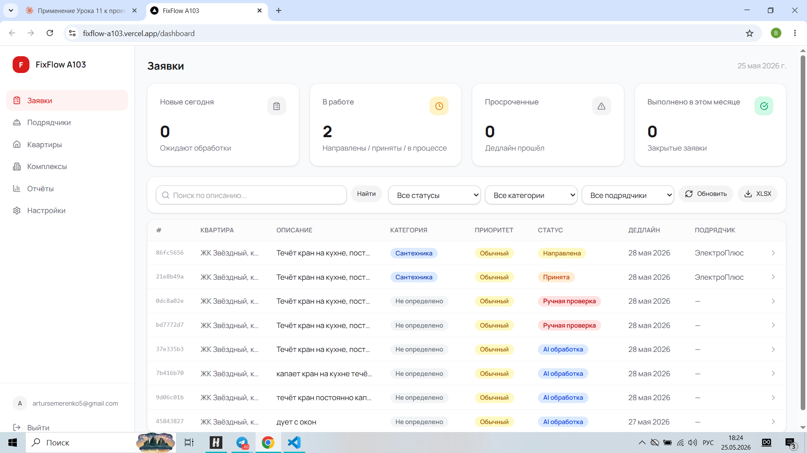
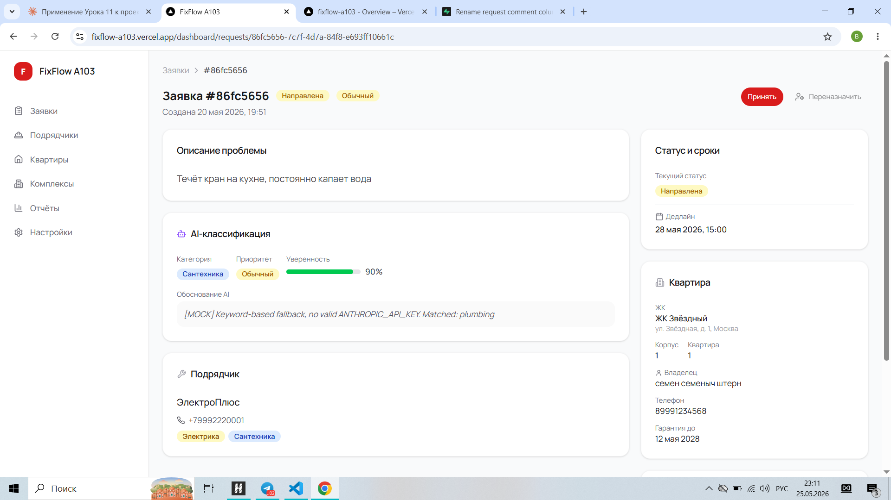
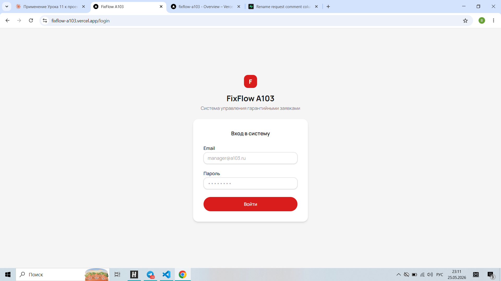
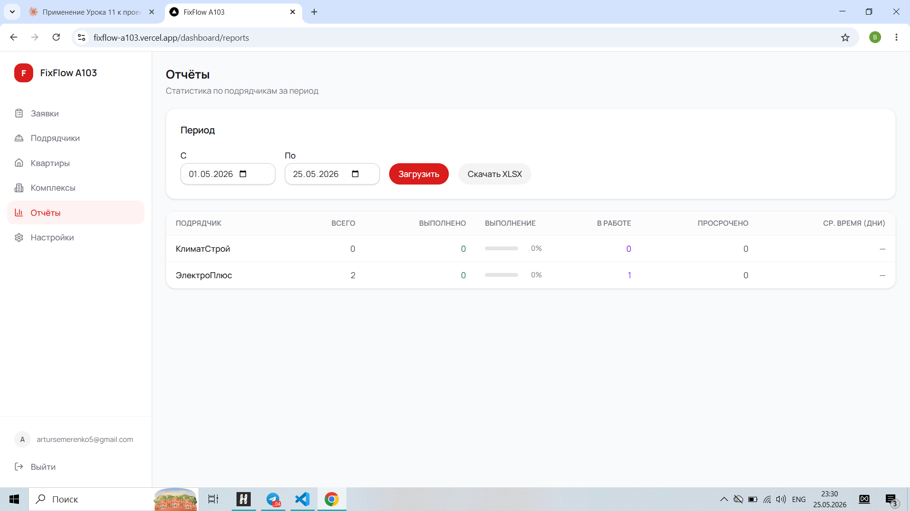
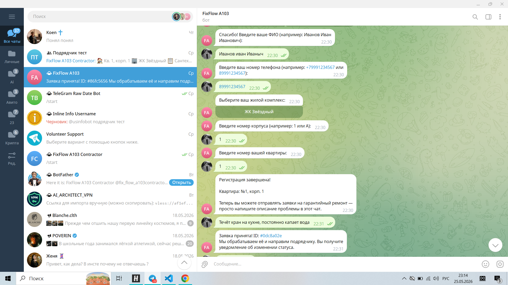
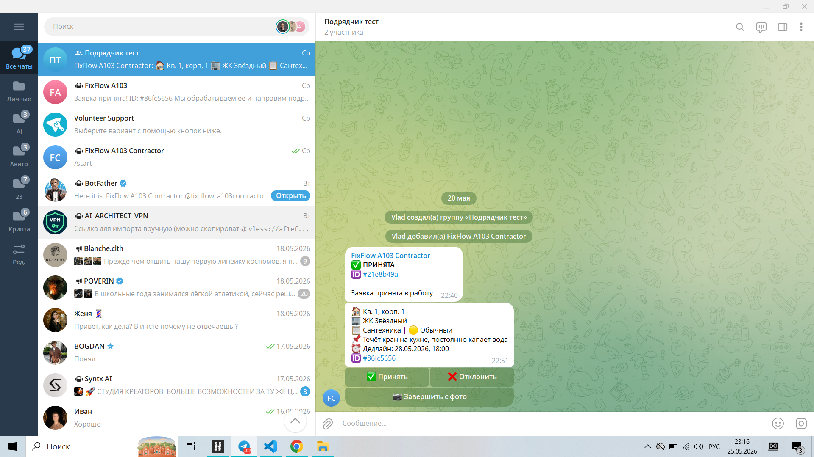

# FixFlow A103

**AI-система диспетчеризации гарантийных заявок для управляющей компании жилых комплексов**

> Жильцы подают заявки через Telegram → Claude Sonnet классифицирует и расставляет приоритеты → заявка автоматически уходит нужному подрядчику → менеджер контролирует всё на веб-дашборде.

**Живой сайт:** [fixflow-a103.vercel.app](https://fixflow-a103.vercel.app)

---

## Скриншоты

| Дашборд менеджера | Детали заявки |
|---|---|
|  |  |

| Вход | Отчёты |
|---|---|
|  |  |

| Telegram-бот жильца | Карточка в канале подрядчика |
|---|---|
|  |  |

---

## Стек технологий

| Уровень | Технология |
|---|---|
| Фреймворк | Next.js 16 (App Router) |
| Язык | TypeScript (strict mode) |
| Стилизация | Tailwind CSS 4.x |
| UI-компоненты | Собственные компоненты в стиле shadcn/ui (Button, Card, Input, Select, Dialog) |
| База данных | Supabase (PostgreSQL 15+, RLS, Storage) |
| Аутентификация | Supabase Auth (JWT в httpOnly cookie) |
| AI | Anthropic Claude Sonnet (`claude-sonnet-4-5`) |
| Мессенджер | Telegram Bot API 7.x |
| Деплой | Vercel (Serverless Functions + Cron) |
| Валидация | Zod |

---

## Ключевые возможности

### Веб-дашборд менеджера

- **Главная страница** — 4 KPI-карточки (всего / в работе / просрочено / выполнено сегодня) + таблица заявок с фильтрами по статусу, категории, подрядчику и периоду
- **Карточка заявки** — полная история изменений статусов, AI-оценка уверенности с визуальным прогресс-баром, фото от жильца и фото выполнения от подрядчика, ручной пересмотр классификации, смена исполнителя
- **Управление справочниками** — CRUD для подрядчиков, квартир и жилых комплексов с диалогами и мгновенным обновлением UI
- **Отчёты** — статистика по подрядчикам за произвольный период: всего / выполнено / в работе / просрочено / среднее время выполнения + визуальный прогресс-бар + экспорт в XLSX

### Telegram-бот жильцов

Полный цикл от регистрации до подачи заявки:

```
/start → согласие 152-ФЗ → ФИО → телефон →
выбор ЖК → выбор корпуса → выбор квартиры → зарегистрирован

Далее: любое сообщение (текст + фото) → создаётся заявка → AI обрабатывает
```

Состояние разговора хранится в Supabase, не в памяти сервера — корректно работает на serverless.

### Telegram-бот подрядчиков

Подрядчик получает карточку заявки в своём канале с inline-кнопками:

- **Принять** — статус переходит в `accepted`
- **Отклонить** — заявка возвращается менеджеру на переназначение
- **Завершить с фото** — подрядчик отправляет фото выполненной работы; статус `completed`

Отправка с 3-кратным retry и экспоненциальным backoff.

### AI-классификация заявок

Подробнее в разделе [AI-классификатор](#ai-классификатор) ниже.

---

## Архитектура

```
┌─────────────────┐     webhook POST      ┌──────────────────────────┐
│  Telegram:      │ ──────────────────▶  │  /api/telegram/owner     │
│  Бот жильцов    │                       │  (верификация секрета,   │
└─────────────────┘                       │   state machine,         │
                                          │   создание заявки)       │
┌─────────────────┐     webhook POST      │                          │
│  Telegram:      │ ──────────────────▶  │  /api/telegram/contractor│
│  Бот подрядчиков│                       │  (callback_query,        │
└─────────────────┘                       │   смена статуса)         │
                                          └────────────┬─────────────┘
                                                       │ await
                                          ┌────────────▼─────────────┐
                                          │   AI-классификатор       │
                                          │   src/agents/handlers/   │
                                          │   Claude Sonnet →        │
                                          │   { category, priority,  │
                                          │     confidence }         │
                                          └────────────┬─────────────┘
                                                       │
                                          ┌────────────▼─────────────┐
                                          │   Supabase PostgreSQL    │
                                          │   13 таблиц, RLS,        │
                                          │   Storage buckets        │
                                          └────────────┬─────────────┘
                                                       │
┌─────────────────┐     REST API          ┌────────────▼─────────────┐
│  Веб-дашборд    │ ◀─────────────────── │  /api/requests/*         │
│  менеджера      │                       │  /api/contractors/*      │
│  Next.js SSR    │                       │  /api/reports/*          │
└─────────────────┘                       └──────────────────────────┘

Vercel Cron → /api/cron/overdue (ежедневно) → уведомления о просрочках
```

**Ключевые архитектурные решения:**

- **Serverless-safe await** — все async-операции завершаются до `return NextResponse.json(...)`, иначе Vercel убивает функцию после ответа
- **Два Supabase-клиента** — `createServerClient()` для менеджерских роутов (через JWT cookie + RLS), `createServiceRoleClient()` только для вебхуков и cron (обходит RLS намеренно)
- **Состояние бота в БД** — `telegram_bot_states` в Supabase вместо in-memory Map, чтобы работало при холодных стартах serverless

---

## AI-классификатор

Система поддерживает два режима работы — это осознанное проектное решение, а не временная заглушка.

### Режим 1: Claude Sonnet (полный AI)

```
ANTHROPIC_API_KEY=sk-ant-...   # реальный платный ключ
USE_MOCK_CLASSIFIER=           # не задан или false
```

- Модель: `claude-sonnet-4-5` через Anthropic Messages API
- Промпт с кэшированием (`cache_control: ephemeral`) — экономит до 90% токенов на системный промпт
- Определяет одну из 8 категорий, приоритет и уровень уверенности (`0.0–1.0`)
- При `confidence < 0.5` → заявка уходит на ручную проверку (`requires_manual_review = true`)
- Retry-логика: 3 попытки с задержками 5с → 30с → graceful fallback
- Каждый вызов логируется в `ai_classification_log` (модель, токены, стоимость, задержка)
- Лимит: 200 вызовов/день из `app_settings`; при превышении — автоматическая ручная проверка
- Стоимость: ~$0.004–0.006 за классификацию

### Режим 2: Keyword Fallback (без AI)

```
USE_MOCK_CLASSIFIER=true       # feature-флаг в env vars
```

Регулярные выражения по ключевым словам → 8 категорий без вызова API. Позволяет запустить систему без платного ключа и не терять заявки при недоступности Anthropic API.

**Переключение не требует редеплоя** — только смена переменной окружения в Vercel.

### 8 категорий заявок

`electrical` · `plumbing` · `hvac` · `structural` · `windows_doors` · `finishing` · `appliances` · `other`

### Поток статусов

```
new → ai_processing → routed → accepted → in_progress → completed
                   ↘ requires_manual_review (confidence < 0.5 или сбой AI)
```

---

## Как запустить локально

### Требования

- Node.js 18+
- Аккаунт Supabase (бесплатный tier достаточен)
- Telegram Bot токены (два бота: для жильцов и подрядчиков)
- Опционально: `ANTHROPIC_API_KEY` для реальной AI-классификации

### 1. Клонировать репозиторий

```bash
git clone https://github.com/Vlad-Barmin/fixflow-a103.git
cd fixflow-a103
npm install
```

### 2. Создать `.env.local`

```bash
# Supabase
NEXT_PUBLIC_SUPABASE_URL=https://xxxx.supabase.co
NEXT_PUBLIC_SUPABASE_ANON_KEY=eyJ...
SUPABASE_SERVICE_ROLE_KEY=eyJ...        # только server-side, никогда не в NEXT_PUBLIC_

# Anthropic (опционально — без него активен keyword-fallback)
ANTHROPIC_API_KEY=sk-ant-...

# Telegram
TELEGRAM_BOT_TOKEN=123456:ABC...
TELEGRAM_BOT_SECRET=your-random-secret
TELEGRAM_CONTRACTOR_BOT_TOKEN=654321:XYZ...
TELEGRAM_CONTRACTOR_BOT_SECRET=another-secret

# System
CRON_SECRET=your-cron-secret
NEXT_PUBLIC_APP_URL=http://localhost:3000

# Режим AI (убрать или поставить false для реального Claude)
USE_MOCK_CLASSIFIER=true
```

### 3. Применить миграции базы данных

Открыть Supabase → SQL Editor → выполнить файл `MIGRATIONS_ALL.sql` целиком.

### 4. Создать аккаунт менеджера

Supabase → Authentication → Users → Invite user → после создания добавить строку в таблицу `manager_profiles`:

```sql
INSERT INTO manager_profiles (id, display_name)
VALUES ('<user-uuid-из-auth.users>', 'Имя менеджера');
```

### 5. Запустить

```bash
npm run dev
```

Открыть [http://localhost:3000/login](http://localhost:3000/login).

### 6. Настроить Telegram-вебхуки (опционально)

Для тестирования ботов нужен публичный URL (например, через [ngrok](https://ngrok.com)):

```bash
# Owner bot
curl "https://api.telegram.org/bot<TELEGRAM_BOT_TOKEN>/setWebhook?url=https://your-ngrok.io/api/telegram/owner?secret=<TELEGRAM_BOT_SECRET>"

# Contractor bot
curl "https://api.telegram.org/bot<TELEGRAM_CONTRACTOR_BOT_TOKEN>/setWebhook?url=https://your-ngrok.io/api/telegram/contractor?secret=<TELEGRAM_CONTRACTOR_BOT_SECRET>"
```

---

## Структура проекта

```
src/
├── app/
│   ├── (auth)/login/                   # Страница входа
│   ├── (dashboard)/dashboard/
│   │   ├── page.tsx                    # KPI + таблица заявок
│   │   ├── requests/[id]/              # Детали заявки
│   │   ├── contractors/                # Управление подрядчиками
│   │   ├── apartments/                 # Управление квартирами
│   │   ├── complexes/                  # Управление ЖК
│   │   ├── reports/                    # Аналитика + XLSX
│   │   └── settings/                   # Настройки
│   └── api/
│       ├── requests/[id]/{reclassify,reassign,comment}/
│       ├── contractors/, apartments/, complexes/
│       ├── reports/{contractor-performance,xlsx}/
│       ├── telegram/{owner,contractor}/
│       └── cron/overdue/
├── agents/                             # AI-классификатор
│   ├── config/                         # Системный промпт, few-shot примеры
│   └── handlers/classify-request.ts   # Основная логика + fallback
├── components/
│   ├── ui/                             # shadcn/ui компоненты
│   └── dashboard/                      # Sidebar, KpiCard, RequestsTable и др.
└── lib/
    ├── supabase/{server,client,admin}  # Supabase-клиенты
    ├── telegram/                       # Обработчики ботов
    └── ai/                             # Обёртка над Anthropic API
```

---

## Переменные окружения

| Переменная | Обязательна | Описание |
|---|---|---|
| `NEXT_PUBLIC_SUPABASE_URL` | Да | URL проекта Supabase |
| `NEXT_PUBLIC_SUPABASE_ANON_KEY` | Да | Anon-ключ (публичный) |
| `SUPABASE_SERVICE_ROLE_KEY` | Да | Service role (только server-side!) |
| `ANTHROPIC_API_KEY` | Нет | Ключ Anthropic; без него активен keyword-fallback |
| `USE_MOCK_CLASSIFIER` | Нет | `true` → принудительно включить keyword-fallback |
| `TELEGRAM_BOT_TOKEN` | Да | Токен бота жильцов |
| `TELEGRAM_BOT_SECRET` | Да | Секрет для верификации вебхука |
| `TELEGRAM_CONTRACTOR_BOT_TOKEN` | Да | Токен бота подрядчиков |
| `TELEGRAM_CONTRACTOR_BOT_SECRET` | Да | Секрет для верификации вебхука |
| `CRON_SECRET` | Да | Заголовок `x-cron-secret` для cron-эндпоинта |
| `NEXT_PUBLIC_APP_URL` | Да | Базовый URL приложения |

---

## Команды разработки

```bash
npm run dev          # Dev-сервер на localhost:3000
npm run build        # Production-сборка
npm run type-check   # Проверка TypeScript (tsc --noEmit)
npm run lint         # ESLint
```

---

## Безопасность и соответствие 152-ФЗ

- Согласие на обработку персональных данных хранится с полным снэпшотом текста и временной меткой (`owner_consents`)
- Поддержка отзыва согласия: анонимизация данных в `apartments` + `revoked_at` в `owner_consents`
- Фото заявок в приватных Storage-бакетах; доступ только через signed URLs (TTL 1 час)
- AI-логи автоматически удаляются через 90 дней
- В промпт Claude передаются только описание проблемы и адрес квартиры — без ФИО и телефона жильца
- JWT менеджера в httpOnly cookie (не localStorage)
- Все Telegram-вебхуки верифицируются по `?secret=` до обработки payload

---

## Лицензия

MIT
